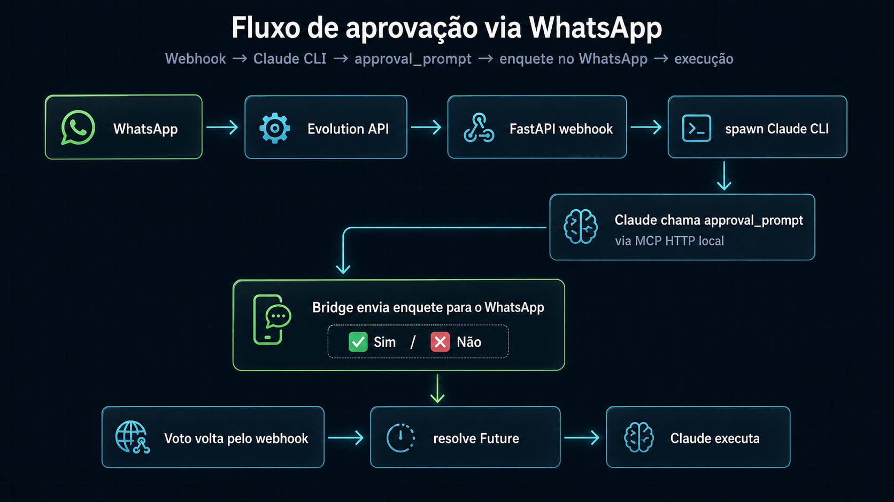

# claude-wa-bridge

**Use o Claude Code pelo WhatsApp.** Mande uma mensagem, o Claude executa no seu projeto, e cada ação sensível (Write/Edit/Bash) pede aprovação via enquete interativa no chat — você toca em ✅ ou ❌ e o agente continua.

Python + FastAPI + Evolution API + MCP (Model Context Protocol) embutido.



---

## Por que isso existe

O Claude Code CLI é incrível, mas vive no terminal. Eu queria poder pedir refactors, rodar comandos e revisar diffs direto do celular, sem abrir SSH. A peça que faltava era um jeito seguro de **aprovar cada tool call antes de executar** — resolvi isso expondo um servidor MCP local com um `permission-prompt-tool` customizado que encaminha a decisão pro WhatsApp.

## Como funciona

1. Mensagem chega no webhook `/wa`
2. Bridge dá `spawn` no `claude -p --mcp-config ... --permission-prompt-tool mcp__wa__approval_prompt`
3. Toda vez que o Claude precisa de Write/Edit/Bash/etc, ele chama a tool MCP `approval_prompt`
4. O handler MCP cria um `asyncio.Future`, dispara uma enquete interativa no WhatsApp e **aguarda**
5. Seu voto (poll, lista ou texto `sim/nao`) resolve o Future → Claude prossegue ou aborta
6. Resposta final é quebrada em chunks de 3500 chars e enviada de volta

## Stack

- **FastAPI + uvicorn** — webhook e servidor MCP no mesmo processo
- **Evolution API** — ponte com WhatsApp (envio de texto, enquetes, presence "digitando…")
- **MCP over HTTP** — servidor embutido em `mcp.py`, conversando com o Claude CLI spawnado
- **asyncio.Lock** global — 1 sessão Claude por vez, pra manter o `current_jid` coerente

## Detalhes legais

- **Aprovação com 3 fallbacks**: poll vote → list reply → texto `sim/nao` (resiliente a versões da Evolution)
- **Presence loop**: mantém "digitando…" enquanto o Claude pensa (refresh a cada 20s)
- **Allowlist por número** (`ALLOWED_NUMBERS`) — não quer que o ex pedir `rm -rf /` no seu repo
- **`/reset`** limpa histórico da conversa
- **Histórico capado em 20 mensagens** por jid, em memória

## Setup

```bash
cd claude_bridge_py
python -m venv .venv
.venv\Scripts\activate          # Windows
# source .venv/bin/activate     # Linux/Mac
pip install -r requirements.txt
cp .env.example .env            # preenche EVO_URL, EVO_APIKEY, EVO_INSTANCE, ALLOWED_NUMBERS
python main.py
```

Aponta o webhook da sua instância Evolution pra `http://seu-host:3333/wa` e manda um "oi".

### Variáveis de ambiente

| var | descrição |
|---|---|
| `EVO_URL` | URL da Evolution API |
| `EVO_APIKEY` | API key da instância |
| `EVO_INSTANCE` | nome da instância |
| `ALLOWED_NUMBERS` | números permitidos, separados por vírgula (vazio = qualquer um) |
| `CLAUDE_MODEL` | `sonnet` (default), `opus`, `haiku` |
| `CLAUDE_TIMEOUT_MS` | timeout por turno (default 300000) |
| `PORT` | default 3333 |

## Comandos no WA

- qualquer texto → pergunta pro Claude
- `/reset` → limpa histórico
- `sim` / `nao` → fallback de aprovação quando a enquete não rolar

## Arquitetura (4 arquivos)

```
main.py          # FastAPI, webhook /wa, orquestração
wa.py            # cliente Evolution API (texto, poll, presence, parse webhook)
mcp.py           # servidor MCP HTTP, tool approval_prompt
claude_runner.py # spawn do claude CLI, parse do stream JSON
```

Sem banco, sem fila, sem Redis. Um processo, quatro arquivos, ~500 linhas.

## Roadmap

- [ ] Suporte a áudio (Whisper → texto)
- [ ] Múltiplas sessões paralelas (remover o lock global)
- [ ] Persistir histórico em SQLite
- [ ] Modo "auto-approve" pra tools read-only

---

Feito por curiosidade num fim de semana. Se achar útil ou tiver ideias, manda bala.
